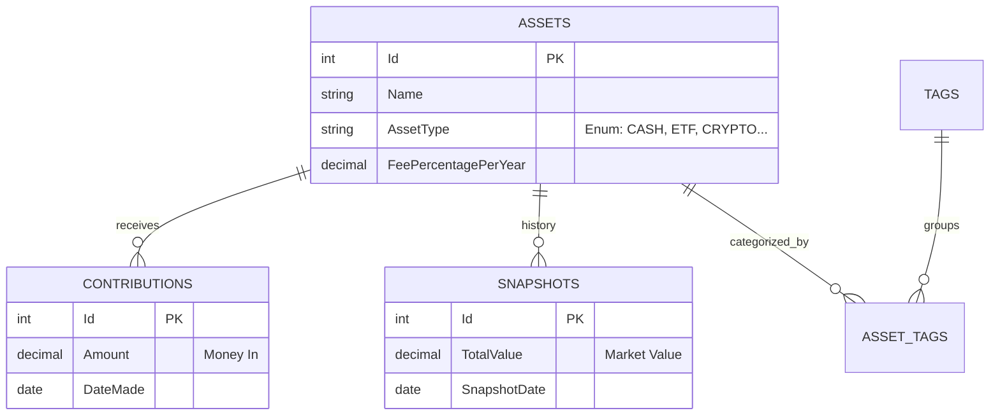

# Investment Tracker

A personal finance application to track the evolution of investment assets (ETFs, Crypto, Cash, etc.), built with a **.NET 10 Web API** backend and a **React 19** frontend.

---

# 📋 Generic Development Standards

> **Reusable Section**: The content below can be copied to any .NET 10/C# 14 project. See `ai-specs/base/` for the full reusable standards.

## 🤖 AI-Assisted Development

This repository is configured to support AI coding copilots through the `ai-specs` directory. All rules are centralized to ensure consistency across different AI tools.

### Why This Approach?

✅ **Single Source of Truth**: Core rules maintained in `ai-specs/base/`  
✅ **Quality Consistency**: Same standards regardless of who (or what) writes code  
✅ **Maintainable Codebase**: Clean architecture and clear separation of concerns  
✅ **Reusable Standards**: Copy `ai-specs/base/` to any new project

### Standards Structure

```
ai-specs/
├── base/                        # ← Reusable for any .NET 10 project
│   ├── README.md                # Usage instructions
│   ├── csharp-standards.md      # C# 14 coding guidelines
│   ├── dotnet-tooling.md        # .NET 10 SDK, CPM, EF Core
│   ├── architecture.md          # VSA + Clean Architecture + DDD
│   ├── testing-standards.md     # MTP, xUnit v3, FluentAssertions
│   ├── frontend-standards.md    # React/TypeScript/Vite
│   └── documentation.md         # AI specs, documentation rules
│
└── project/                     # ← Project-specific
    ├── architecture.md          # Layer mapping, folder structure
    ├── domain-model.md          # Entities, ERD
    ├── api-spec.yml             # REST endpoints
    └── development-guide.md     # Setup, commands
```

## 📖 Core Development Principles

All development follows these principles (defined in `ai-specs/base/`):

1. **Small Tasks, One at a Time**: Baby steps, never skip ahead
2. **Test-Driven Development (TDD)**: Write failing tests first
3. **Type Safety**: Fully typed code (C# 14 strictness, TypeScript)
4. **Modern .NET Ecosystem**: `.slnx` solutions, Central Package Management (CPM)
5. **Clear Naming**: Descriptive variables and functions
6. **English Only**: All code, comments, documentation in English
7. **Incremental Changes**: Focused, reviewable modifications

## 🏗️ Architecture Patterns

The recommended architecture stack:

| Pattern | Use Case |
|---------|----------|
| **VSA (Vertical Slice)** | Web API feature organization |
| **Clean Architecture** | Complex domain logic layers |
| **DDD Building Blocks** | Entities, Value Objects, Repositories |

### The "Rule of Three" for Refactoring

1. Write the code in Feature A (no sharing)
2. Copy it to Feature B (accept duplication)
3. Copy it to Feature C → **STOP**. Only then extract to shared.

## 🧪 Testing Stack

- **Runner**: Microsoft.Testing.Platform (MTP)
- **Framework**: xUnit v3
- **Assertions**: FluentAssertions
- **Mocking**: Moq

## 🎯 Benefits

### For Developers
- ✅ **Consistent Code Quality**: AI follows the same standards every time
- ✅ **Comprehensive Testing**: Automatic coverage across all layers
- ✅ **Faster Onboarding**: New team members reference the same rules

### For Projects
- ✅ **Maintainable Codebase**: Clean architecture and clear separation
- ✅ **Production-Ready Code**: TDD, error handling, and validation built-in
- ✅ **Living Documentation**: API specs and data models always current

---

# 📦 Investment Tracker (Project-Specific)

> **Project Section**: The content below is specific to the Investment Tracker application.

## 📁 Repository Structure

```
.
├── ai-specs/                    # Development standards and specifications
│   ├── base/                    # Reusable standards (copy to new projects)
│   └── project/                 # Investment Tracker specific
├── src/                         # Application Source Code
│   ├── InvestmentTracker.API/   # .NET 10 Web API
│   ├── InvestmentTracker.Client/# React 19 Frontend
│   ├── InvestmentTracker.Domain/# Domain Logic & Entities
│   └── InvestmentTracker.Infra/ # EF Core & Database
├── tests/                       # Unit & Integration Tests
├── Directory.Packages.props     # Central Package Management (CPM)
├── Directory.Build.props        # Global build configuration
├── InvestmentTracker.slnx       # Modern Solution File
└── README.md                    # This file
```

## 🚀 Quick Start

### Prerequisites

* .NET 10 SDK
* Node.js 20+ (for React 19)
* Visual Studio / VS Code

### Backend Setup

```bash
# Navigate to the API folder
cd src/InvestmentTracker.API

# Apply Database Migrations (generates investments.db)
dotnet ef database update --project ../InvestmentTracker.Infra

# Run the API
dotnet run
```
The API will be available at `https://localhost:7000` (or similar).

### Frontend Setup

```bash
# Navigate to the Client folder
cd src/InvestmentTracker.Client

# Install Dependencies
npm install

# Run the React App
npm run dev
```
The UI will be available at `http://localhost:5173`.

## 💡 Command-Based Development Workflow

Use commands defined in `ai-specs/.commands` for efficient development:

### Step 1: Enrich the User Story (Optional)

```
/enrich-us SCRUM-10
```
Analyzes the user story and generates detailed acceptance criteria.

### Step 2: Plan the Feature

```
/plan-backend-ticket SCRUM-10
```
Creates a comprehensive implementation plan in `ai-specs/changes/`.

### Step 3: Implement the Feature

```
/develop-backend @SCRUM-10_backend.md
```
The AI follows the plan precisely with TDD and proper testing.

## 📚 Technical Context

### Architecture

* **Frontend:** React 19 (Vite), Recharts (visualization), TailwindCSS
* **Backend:** ASP.NET Core 10 Web API
* **Database:** SQLite (Single-file, serverless)
* **ORM:** Entity Framework Core (Code-First)

### Domain Logic

#### The "Snapshot" Model

Instead of tracking every trade execution, we track the **Resulting State**:
1. **Contributions:** A ledger of money deposited into the asset
2. **Snapshots:** The total market value of the asset at a specific date

**Profit/Loss Calculation:**
$$ \text{PnL} = \text{Latest Snapshot Value} - \sum \text{Contributions} $$

#### Fee Calculation

Fees are derived mathematically (not stored as transactions):
* Each asset has a `FeePercentagePerYear` (e.g., 0.50%)
* The system integrates this percentage over time periods between snapshots

### Data Model



**Schema Details:**
* **Assets:** Strictly typed (no magic strings). `ISIN` and `Ticker` are nullable.
* **Contributions:** Only tracks deposits. Dividends/Interest are assumed reinvested.
* **Tags:** Assets can have multiple tags (e.g., "Tech" AND "High Risk").

## 🤝 Contributing

When contributing:

1. Update `ai-specs/base/` if changing reusable rules
2. Update `ai-specs/project/` if changing project-specific standards
3. Test with multiple AI copilots to ensure compatibility
4. Document breaking changes clearly
5. Follow the same standards you're defining!

## 📄 License

Licensed under the MIT License
