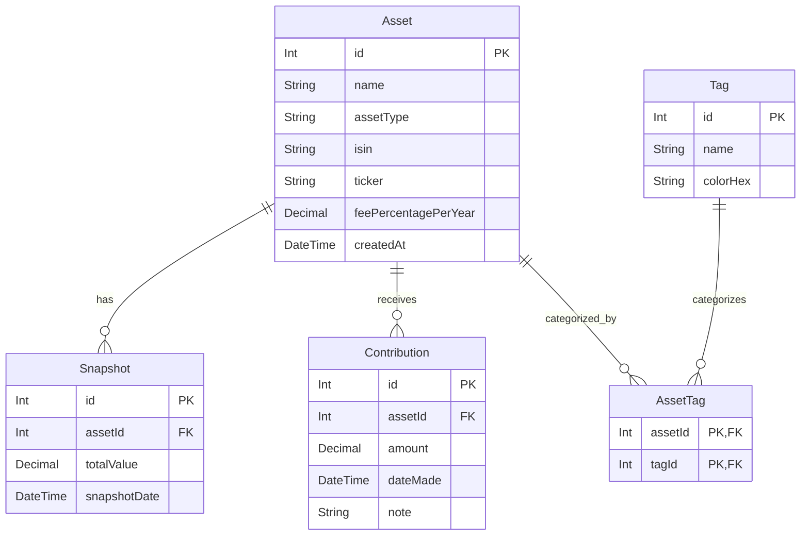

# Data Model Documentation

This document describes the data model for the Investment Tracker application, including entity descriptions, field definitions, relationships, and an entity-relationship diagram.

## Model Descriptions

### 1. Asset
Represents a financial asset held in the portfolio.

**Fields:**
- `id`: Unique identifier for the asset (Primary Key)
- `name`: Name of the asset (e.g., "S&P 500 ETF")
- `assetType`: Type of the asset (Enum: Cash, ETF, Fund, Crypto, Stock, Pension)
- `isin`: International Securities Identification Number (optional)
- `ticker`: Stock ticker symbol (optional)
- `feePercentagePerYear`: Annual fee percentage, stored as a decimal (e.g., 0.0050 for 0.50%)
- `createdAt`: Timestamp when the asset was created

**Relationships:**
- `snapshots`: One-to-many relationship with Snapshot model
- `contributions`: One-to-many relationship with Contribution model
- `assetTags`: Many-to-many relationship with Tag model (via AssetTag join entity)

### 2. Snapshot
Represents the market value of an asset at a specific point in time.

**Fields:**
- `id`: Unique identifier for the snapshot (Primary Key)
- `assetId`: Foreign key referencing the Asset
- `totalValue`: Total market value of the asset at this time
- `snapshotDate`: Date of the snapshot

**Relationships:**
- `asset`: Many-to-one relationship with Asset model

### 3. Contribution
Represents a deposit or addition of capital to a specific asset.

**Fields:**
- `id`: Unique identifier for the contribution (Primary Key)
- `assetId`: Foreign key referencing the Asset
- `amount`: The monetary amount contributed
- `dateMade`: Date the contribution was made
- `note`: Optional note or description

**Relationships:**
- `asset`: Many-to-one relationship with Asset model

### 4. Tag
Represents a label used to categorize or group assets.

**Fields:**
- `id`: Unique identifier for the tag (Primary Key)
- `name`: Name of the tag
- `colorHex`: Optional color code for UI representation

**Relationships:**
- `assetTags`: Many-to-many relationship with Asset model (via AssetTag join entity)

### 5. AssetTag
Join entity representing the many-to-many relationship between Assets and Tags.

**Fields:**
- `assetId`: Foreign key referencing the Asset
- `tagId`: Foreign key referencing the Tag

**Relationships:**
- `asset`: Many-to-one relationship with Asset model
- `tag`: Many-to-one relationship with Tag model

## Entity Relationship Diagram

## Key Design Principles

1. **Referential Integrity**: All foreign key relationships ensure data consistency across the system.

2. **Flexibility**: The tagging system allows for flexible categorization of assets (e.g., by risk, sector, or strategy).

3. **Audit Trail**: Contributions and snapshots are time-stamped to provide a history of portfolio evolution.

4. **Extensibility**: The modular design allows for easy addition of new features and data points.

5. **Data Normalization**: The model follows database normalization principles to minimize redundancy and ensure data integrity.

## Notes

- All `id` fields serve as primary keys with auto-increment functionality
- Foreign key relationships maintain referential integrity
- Optional fields allow for flexible data entry while maintaining required core information