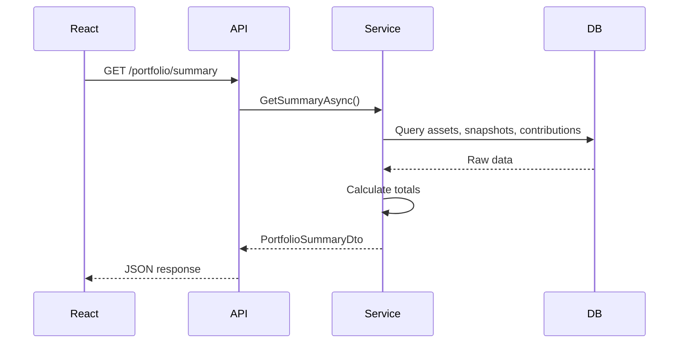

# Design: Portfolio Reporting

## Overview

Add portfolio reporting capabilities with API endpoints for aggregated metrics, historical data, and return calculations. The React frontend will display a dashboard with interactive charts.

## API Endpoints

### `GET /portfolio/summary`

Returns current portfolio metrics.

**Response: `PortfolioSummaryDto`**
```json
{
  "totalValue": 50000.00,
  "totalInvested": 45000.00,
  "pnL": 5000.00,
  "pnLPercent": 11.11,
  "assetCount": 5,
  "lastUpdated": "2026-01-31T00:00:00Z"
}
```

### `GET /portfolio/history`

Returns portfolio value over time for charting.

**Query Parameters:**
- `from` (date, optional): Start date
- `to` (date, optional): End date

**Response: `PortfolioHistoryDto`**
```json
{
  "points": [
    { "date": "2025-01-01", "value": 42000.00, "invested": 40000.00 },
    { "date": "2025-02-01", "value": 44000.00, "invested": 42000.00 }
  ]
}
```

### `GET /portfolio/allocation`

Returns asset allocation breakdown.

**Response: `PortfolioAllocationDto`**
```json
{
  "byType": [
    { "type": "ETF", "value": 30000.00, "percentage": 60.0 },
    { "type": "Crypto", "value": 15000.00, "percentage": 30.0 },
    { "type": "Cash", "value": 5000.00, "percentage": 10.0 }
  ]
}
```

### `GET /portfolio/returns`

Returns calculated returns for various periods.

**Query Parameters:**
- `asOf` (date, optional): Calculate as of this date (default: today)

**Response: `PortfolioReturnsDto`**
```json
{
  "twr": 12.5,
  "mwr": 11.8,
  "periods": {
    "ytd": 3.2,
    "oneYear": 12.5,
    "threeYear": 28.0,
    "fiveYear": 45.0,
    "allTime": 52.0
  }
}
```

## Architecture

```
src/InvestmentTracker.Api/
├── Controllers/
│   └── PortfolioController.cs          # New controller
├── DTOs/
│   └── Portfolio/
│       ├── PortfolioSummaryDto.cs
│       ├── PortfolioHistoryDto.cs
│       ├── PortfolioAllocationDto.cs
│       └── PortfolioReturnsDto.cs

src/InvestmentTracker.Domain/
├── Services/
│   ├── IPortfolioService.cs            # Interface
│   ├── PortfolioService.cs             # Implementation
│   └── IReturnCalculator.cs            # Return calc interface
│   └── ReturnCalculator.cs             # TWR/MWR implementation
```

## Return Calculation Formulas

### Time-Weighted Return (TWR)
Eliminates effect of cash flows by calculating sub-period returns:
```
TWR = [(1 + R1) × (1 + R2) × ... × (1 + Rn)] - 1
Where Ri = (EndValue - CashFlow) / StartValue - 1
```

### Money-Weighted Return (MWR)
Uses IRR formula solving for r where:
```
∑ CFi / (1 + r)^ti = 0
```
Newton-Raphson iteration for approximation.

## Data Flow



## Error Handling

| Scenario | Response |
|----------|----------|
| No assets exist | 200 with zeroed values |
| No snapshots for asset | Use 0 for that asset's value |
| Date range invalid | 400 Bad Request |

## Performance Considerations

- Cache summary calculations (1-minute TTL)
- Limit history query to max 5 years by default
- Use database aggregation where possible
